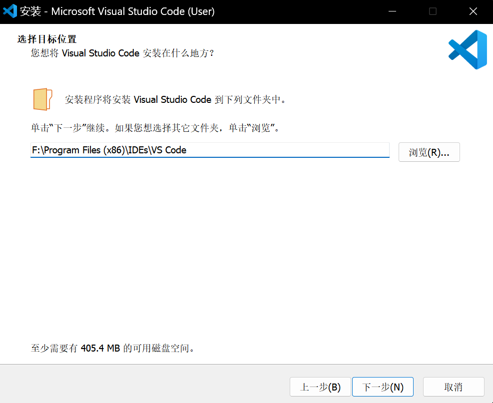
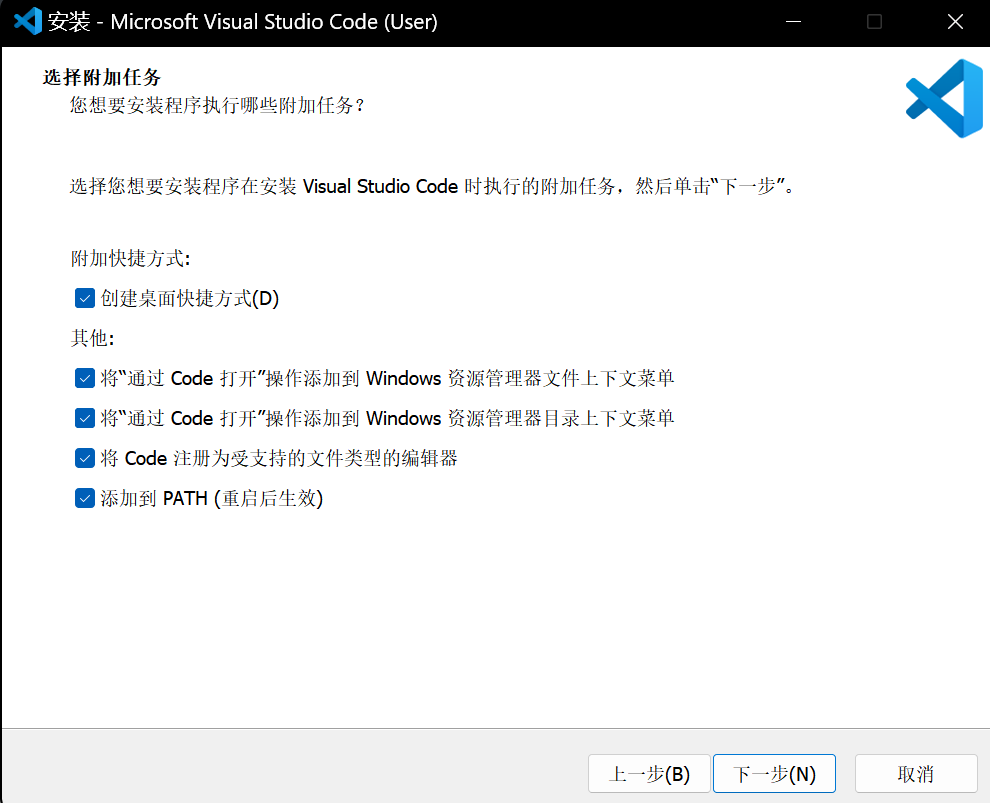
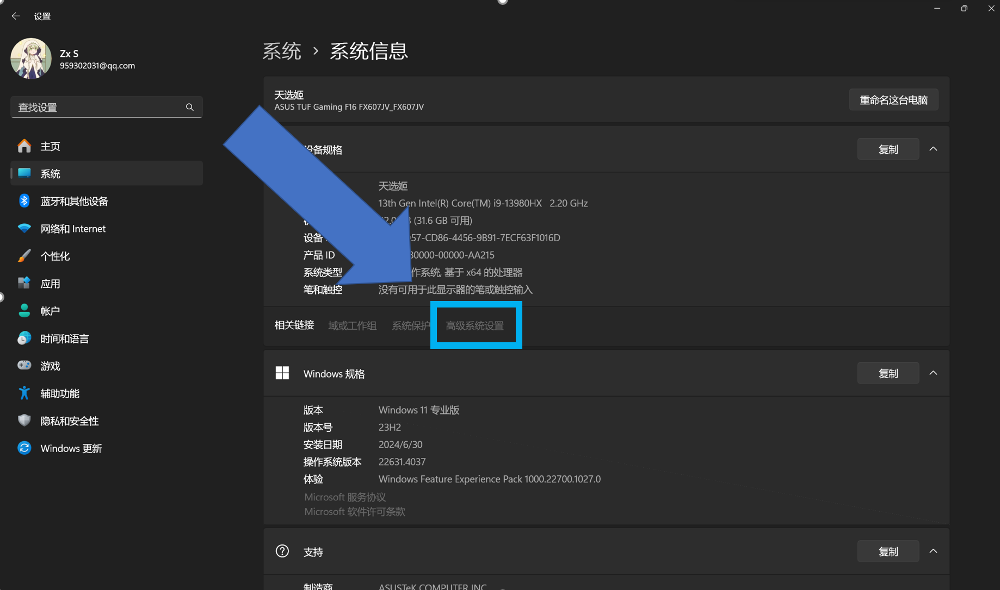

# C语言从这里开始

## 前置任务: 配置编程环境

工欲善其事,必先利其器。没有人希望在写好第一个程序满心欢喜想要运行时遇到 `"gcc.exe: 找不到xxx"` 等等这样的报错。所以配置一个令人舒适的编程环境是每个C programmer的必经之路。

本文以 **VSCode+MSYS2+GCC** 为例(这也是现在较为普遍使用的环境)带你配置好编程环境,为你准备新手村的装备。

### VSCode

作为一个新时代的人, 学会使用VSCode这个新时代的IDE自然是必不可少的。

#### 下载VSCode

  - 前往 [VSCode官网](https://code.visualstudio.com/) 点击Download For Windows下载。

  - 或点击 [这个链接](https://code.visualstudio.com/docs/?dv=win64user) 直接下载

  - 点击下载后,等待片刻, 同时憧憬一下未来的编程之路

#### 安装VSCode

  - 双击安装包开始安装。

  - 选择目标位置时选择自己喜欢的目录。 **建议为编程单独准备一个硬盘分区或者一个根文件夹。** 并将VSCode安装到该文件夹中的一个空文件夹中。

  - 例如:
    

  - 这里建议全部勾选

    

#### 配置VSCode
  
  - 安装完成后打开的界面:

    

  - 如下图操作切换VSCode的界面语言:

    

  - 完成后重启VSCode,可以看到界面已经变为了中文的。

### MSYS2

  MSYS2是一个软件构建平台,在windows系统中提供了一系列构建工具。我们需要用到其中的MinGW等工具。

- Soyorin: 还带了和git bash一样的终端,可以模拟linux环境。 ~~是后面会用到的妙妙小工具。~~

#### 安装MSYS2

- 下载安装包
  
  - [MSYS2官网](https://www.msys2.org/#installation)

  - [GitHub发行页](https://github.com/msys2/msys2-installer/releases)
  
- 由于官网不提供latest版本的链接,这里就不放下载直链了。点进去自己下最新版即可。 ~~(其实还有[测试版](https://github.com/msys2/msys2-installer/releases/download/nightly-x86_64/msys2-x86_64-latest.exe)的直链,不过不是很推荐用)~~

- 下载完成双击安装。

- **唯一需要注意的点** : **在选择安装路径时,路径中不要带空格或中文或者 ``#``、``!``等特殊字符!** 因为MSYS2中许多工具(包括我们要用的gcc)是基于unix的,不能处理非ASCII字符,如果有这些字符,在使用过程中会爆许多奇怪的问题。

- **别忘了记下安装的路径。可以复制一下,后面配置环境变量会用到。**

#### 安装工具链

- 安装完成点击立即运行。或进入安装目录运行 ``MSYS2.exe``。
- 在打开的终端中输入 ``pacman -S --needed base-devel mingw-w64-ucrt-x86_64-toolchain`` ,安装ucrt。

#### 配置环境变量

- 安装完成后需要将工具添加到[Path环境变量](https://www.cnblogs.com/metahuber/p/16881827.html)中。

  - > Soyorin: Windows屎山魅力时刻即将到达

  - 关于环境变量配置的教程网上有很多。这里我讲一种作为参考。

    - 右键左下角开始图标,点击弹出菜单中的 **``系统``**,打开设置的系统信息界面。

    - 点击设备规格的相关链接中的 **``高级系统设置``**

      

    - 在弹出的窗口中点击 **``环境变量``**

    - 在 **``用户变量``** 中找到 **``Path``** 这一项,双击打开编辑。

    - 点击右侧的 **``新建``** ,把上面记下的路径加上``\ucrt64\bin``,输入到这一条变量中。
  
      - 例如我的安装路径是 ``F:\MSYS2``,那么就输入``F:\MSYS2\ucrt64\bin``。

    - 完成后点击确定。每一级菜单都要点确定。确保编辑的变量被正确保存。

    - 完成后右击开始按钮,打开终端,输入 ``gcc --version`` , 如果上面的步骤都配置正确,那么这里应该会有显示:

      - 但如果你的显示是这样的: 可以尝试关闭原来开着的终端,重新打开,加载环境变量。

      - 如果还是不行的话, ~~恭喜你,~~ 可以回到上面重新做一遍了。

      - > Soyorin: ~~开门爆红, 大吉之兆。~~

### 为VSCode配置C编译器

- 安装C扩展。
  
  - 和上面一样,直接在扩展的搜索栏中搜索"C"即可。
  
  

  直接安装这个。 **不需要** 安装C Extension Pack、C Theme和CMakeTools。

  -----
  To Be Continued
  -----