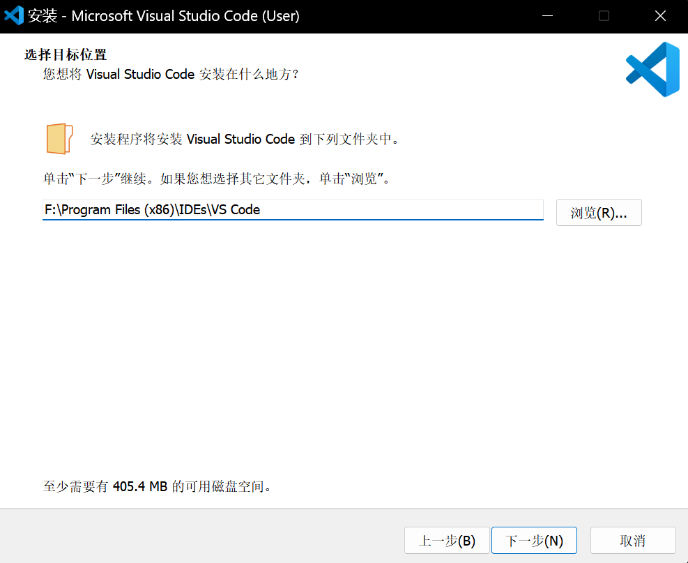
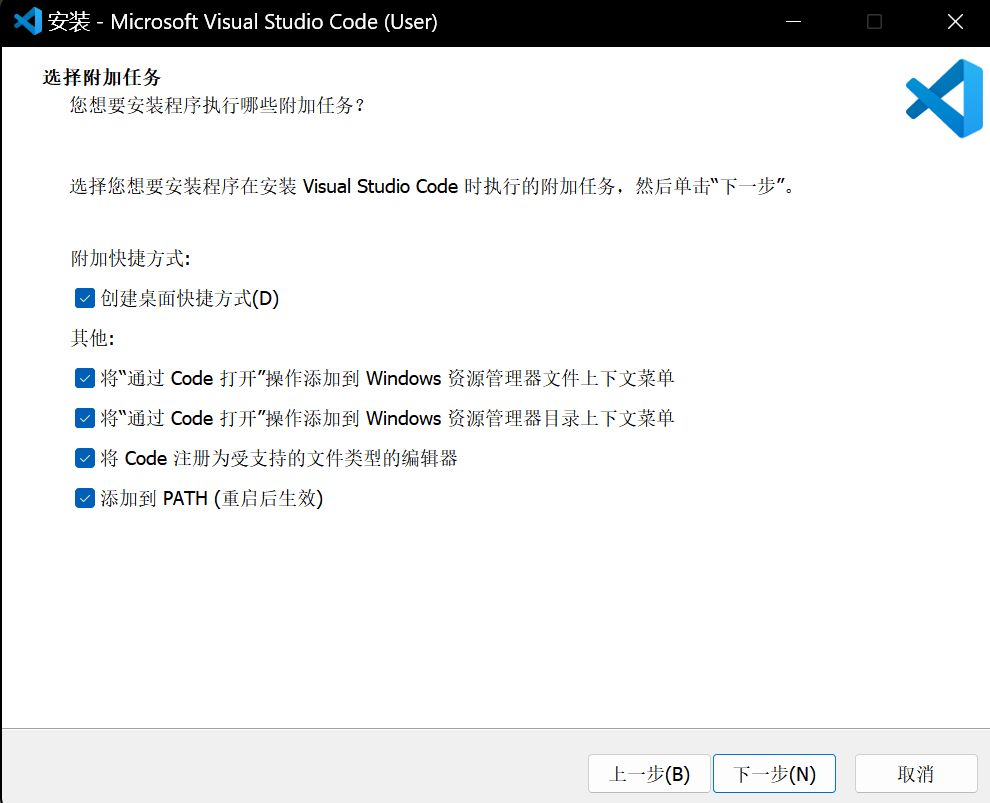

# C语言从这里开始

## 前置任务: 配置编程环境

工欲善其事,必先利其器。没有人希望在写好第一个程序满心欢喜想要运行时遇到 `"gcc.exe: 找不到xxx"` 等等这样的报错。所以配置一个令人舒适的编程环境是每个C programmer的必经之路。

本文以 **VSCode+MSYS2+GCC** 为例(这也是现在较为普遍使用的环境)带你配置好编程环境,为你准备新手村的装备。

### VSCode

作为一个新时代的人, 学会使用VSCode这个新时代的IDE自然是必不可少的。

- 下载VSCode

  - 前往<a href="https://code.visualstudio.com/">VSCode官网</a> 点击Download For Windows下载。

  - 或点击<a href="https://code.visualstudio.com/docs/?dv=win64user">这个链接</a>直接下载

  - 点击下载后,等待片刻, 同时憧憬一下未来的编程之路

- 安装VSCode

  - 双击安装包开始安装。

  - 选择目标位置时选择自己喜欢的目录。 **建议为编程单独准备一个硬盘分区或者一个根文件夹。** 并将VSCode安装到该文件夹中的一个空文件夹中。

  - 例如:

    

  - 这里建议全部勾选

    
