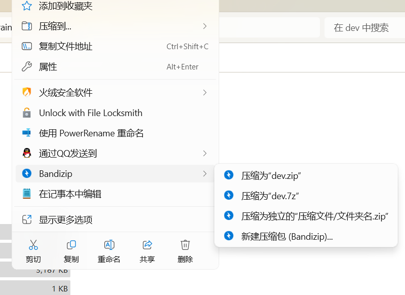
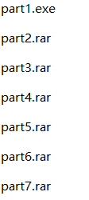

> [!IMPORTANT]
> 为了保证顺利阅读，你需要：
>
>- 知道什么是计算机上面的**文件**
>- 知道什么是**文件扩展名**，以及如何使其可见

# 何为压缩文件？

**压缩文件**又名**压缩包**，是对一组文件（或文件夹）的打包。打包不仅能节省空间，在传输的时候（比如发给别人）也会方便很多。**解压**是压缩的逆操作，从网上下载下来的压缩文件都要通过解压才能正常浏览与运行。

压缩和解压都需要专门的软件，你可以下载 [7-Zip](https://www.7-zip.org/) 或其它软件进行相关操作。

> [!WARNING]
> 我们**不推荐**你使用某些国产压缩软件，比如臭名昭著的**快压**与 2345 旗下的**好压**，捆绑安装与广告弹窗会让你的电脑变得像广告墙一样。如果你没有独立解决这些问题的能力，请尽可能远离它们。
>
> 自 Windows 7 起 Windows 自带了解压功能，但由于其界面具有不小的迷惑性（让你误以为文件已经解压实际上没有），我们仍然推荐你安装一个专门的压缩软件。
>

## 压缩

一般情况下，我们可以在文件夹中选择需要的文件（通常是多个）或文件夹后右键并选择压缩，就像下面这样：

（这里用的是 Bandzip，因此图标不一样，7-Zip 的菜单需要点击“显示更多选项”才会出现）

我们可以在压缩前选择压缩的格式、文件名与是否加密等等。

## 解压

当我们从网上下载了一些压缩文件，很多时候都是需要解压的（尤其是软件）。

如果选中并右键一个压缩文件，你会看到类似的菜单，不同的解压选项对应着不同的解压路径（7-Zip 的菜单还是需要点击“显示更多选项”才会出现）

总而言之，解压后你就可以快乐地使用这些文件了，但将文件妥善地整理到合适的位置也是很有必要的。

## 分卷压缩

虽说打包能方便传输，但如果单个压缩文件太大，在传输时麻烦也不小（有的平台会限制最大文件大小）。**分卷压缩**则是一种比较平衡的手段，将一个大压缩文件（通常是超过 10 G）分成几个小的文件，解压时只需选择解压第一个，其他部分也会跟着一起解压。

通常而言，你从网上下载到的分卷压缩的文件会有如下图的编号，这样就能分清楚哪个是第一个了：

压缩软件在压缩时也会有分卷压缩的选项，你可以勾选来创建自己的分卷压缩文件。

## 有关在线解压

> 为什么我解压要收费？

那是网盘的收费服务，因为还没下载下来。你下载下来之后自己解压是没人会收你一分钱的。总之，**没事不要在线解压！**